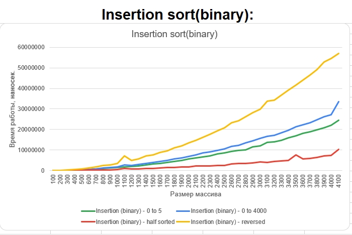

# КДЗ#1 по курсу ПиАА
## Выполнил Горковец Роман Романович, БПИ204
Среда разработки: CLion 2021.2.3. Собрано в Windows

Дата выполнения: 22.02.2022

Результаты работы программы: ./results_nanos

***
### Чек-лист

Наименование | Статус
----- | -----
Все труебуемые виды сортировок | Done
Сохранение результатов расчетов в .csv формат | Done
Графики, их анализ | Done
Ассерт на условие отсортированности массива. В случае false - бросатеся исключение | Done
Программы были запущены несколько раз для чистоты эксперимента | Done
Значения итоговых файлов были усреднены для более точной картины происходящего | Done
Сохранение входных массивов в формате .csv | Done
Сохрвнение отсортированных входных массивов в формате .csv | Done
Подсчет времени сортировки в наносекундах | Done
Документация к коду | Done

***
### Запуск:
Запуск main.cpp

**СMakeLists уже создан**

***
### Анализ графиков
#### Размерности 50-300. Шаг 10:

Наиболее плохие результаты при малых размерах массива и максимальной разнице в значении элементов показывают, как и ожидалось, квадратичные сортировки. Кроме того, условия Айверсона замедлили скорость работы алгоритма сортировки пузырьком: на любых размерностях массива от 50 до 300 классический пузырек выигрывает во временной оценке почти в два раза.
Наиболее хорошие результаты по временным показателям показывают быстрая сортировка (Хоара), сортировка подсчетом, цифровая сортировка.

В сравнении с предыдущим графиком заметно ухудшение классической пузырьковой сортировки.
Также, несложно заметить, что быстрая сортировка с разбиением Ломуто показала лучшую производительность в сравнении с предыдущим экспериментом(~5 раз).

На данном этапе можно заметить, что сортировка выбором нечувствительна к расположению объектов в массиве. Почти отсортированный массив и совершнно случайный сортируется примерно одинаковое количество времени.
Показала свою нестабильность быстрая сортировка с разделением Ломуто (выделено красным).

Сильно деградировали сортировки пузырьком. Производительность упала почти в два раза.
Также заметно снижение производительности у быстрой сортировки с разбиением Ломуто, которая показывает результат на уровне квадратичных алгоритмов. (Текущий вид массива является худшим случаем для данного разбиения)

Наилучший результат сортировка пузырьком показывает при почти отсортированных входных данных и на массиве с небольшой разницей в величинах элементов - производится меньше операции с обменом элементов.

Заметно ухудшение скорости работы алгоритма при вводе рандомного массива с маленькой разницей между значениями элементов.
В целом, результат хуже классического пузырька.

Сильной разницы после прошлого эксперимента не наблюдается.
В целом, результат хуже классического пузырька.

Сортировка выбором практически нечувствительна к паттерну входных данных, поэтмоу показывает приблизительно одинаковый результат во всех 4 случаях.
Однако это же является ее недостатком, так как почти отсортированный массив обрабатывается достаточно долго даже в сравнении с Bubble Sort. В среднем по времени (по результатам измерений) она работает примерно так же, как пузырек.

Сортировка простыми вставками показывает довольно неплохие показатели, немного превосходящие те, что показывали сортировки, рассмотренные ранее. Однако заметен существенный спад проивзодительности при обработке обратно отсортированного массива.
Хорошей же стороной алгоритма является то, что почти отсортированные данные обрабатываются достаточно быстро.

Заметно сильное улучшение проивзодительности алгоритма простых вставок. Все еще присутствует сильная деградация алгоритма при вводе обратно отсортированного массива, но в остальном алгоритм очень эффективен в сравнении с рассмотренными выше квадратичными сортировками.

Сортировка слиянием не сильно чувствительна к разнице в паттерне входных данных. А ввиду того, что сложность алгоритма O(nlogn) и сама по себе она является стабильной, иногда есть смысл выбирать именно сортировку слиянием, а не быструю сортировку.

Быстрая сортировка с разбиением Хоара показывает отличные результаты на всех приведенных видах массива. Более того, сортировка не труебует использования дополнительной памяти. Сортировка имеет низкую сложность - O(nlogn), однако имеет ряд недостатков в виде рекурсивной реализации, а также возможностью неудачного выбора pivot'а, из-за которого алгоритм может деградировать до O(n^2).

Быстрая сортировка с разбиением Ломуто на приведенных входных данных работает замтено медленнее в сравнении с Хоаром. Заметна сильная разница во времени исполнения при сортировке обратно отсортированного массива, которая обусловлена алгоритмом выбора pivot'а, который в данном случае выбирает наихудший для данной сортировки вариант.

Пирамидоидальная сортировка не чувствительна к разнице в паттерне входных данных. Более того, ввиду своей структуры, сортировка в худшем случае имеет сложность O(nlogn). 

Цифровая сортировка выигрывает все предыдущие по временным показателям, однако можно заметить, что сортировка показывает худший результат при входных данных содержащих "длинные" числа. Соответственно резонно будет использовать Radix Sort в тех случаях, когда длина элементов входного массива невелика.

Сортировка подсчетом показывает лучшие результаты на приведенных входных данных реди всех сортировок. Заметим, что сортировка показывает худшую производительность при большой разницце между минимальным и максимальным входными элементами. Так, при обработке массива со случайными числами от 0 до 4000 сортирвока показывает результат заметно более плохой.
***
#### Размерности 100-4100. Шаг 100:

Наблюдается примерно та же картина, что и на малых размерах массива. Хуже всего себя показывают сортировки пузырьком и сортировка выбором. Кроме того, условия Айверсона замедлили скорость работы алгоритма сортировки пузырьком.
Наиболее хорошие результаты по временным показателям показывают быстрая сортировка (Хоара), сортировка подсчетом, цифровая сортировка, пирамидоидальная.

В сравнении с предыдущим графиком заметно ухудшение классической пузырьковой сортировки.
Также, несложно заметить, что быстрая сортировка с разбиением Ломуто показала лучшую производительность в сравнении с предыдущим экспериментом.

На данном этапе можно заметить, что сортировка выбором нечувствительна к расположению объектов в массиве. Почти отсортированный массив и совершнно случайный сортируется примерно одинаковое количество времени.

Сильно деградировали сортировки пузырьком. Производительность упала почти в два раза.
Также заметно снижение производительности у быстрой сортировки с разбиением Ломуто, которая показывает результат на уровне квадратичных алгоритмов. (Текущий вид массива является худшим случаем для данного разбиения)

Наилучший результат сортировка пузырьком показывает при почти отсортированных входных данных и на массиве с небольшой разницей в величинах элементов - производится меньше операции с обменом элементов.

Заметно ухудшение скорости работы алгоритма при вводе рандомного массива с маленькой разницей между значениями элементов.
В целом, результат хуже классического пузырька.

Сильной разницы после прошлого эксперимента не наблюдается.
В целом, результат хуже классического пузырька.

Сортировка выбором практически нечувствительна к паттерну входных данных, поэтмоу показывает приблизительно одинаковый результат во всех 4 случаях.
Однако это же является ее недостатком, так как почти отсортированный массив обрабатывается достаточно долго даже в сравнении с Bubble Sort. В среднем по времени (по результатам измерений) она работает примерно так же, как пузырек.

Сортировка простыми вставками показывает довольно неплохие показатели, немного превосходящие те, что показывали сортировки, рассмотренные ранее. Однако заметен существенный спад проивзодительности при обработке обратно отсортированного массива.
Хорошей же стороной алгоритма является то, что почти отсортированные данные обрабатываются достаточно быстро.

Заметно сильное улучшение проивзодительности алгоритма простых вставок. Все еще присутствует сильная деградация алгоритма при вводе обратно отсортированного массива, но в остальном алгоритм очень эффективен в сравнении с рассмотренными выше квадратичными сортировками.

Сортировка слиянием не сильно чувствительна к разнице в паттерне входных данных. А ввиду того, что сложность алгоритма O(nlogn) и сама по себе она является стабильной, иногда есть смысл выбирать именно сортировку слиянием, а не быструю сортировку.

Быстрая сортировка с разбиением Хоара показывает отличные результаты на всех приведенных видах массива. Более того, сортировка не труебует использования дополнительной памяти. Сортировка имеет низкую сложность - O(nlogn), однако имеет ряд недостатков в виде рекурсивной реализации, а также возможностью неудачного выбора pivot'а, из-за которого алгоритм может деградировать до O(n^2).

Быстрая сортировка с разбиением Ломуто на приведенных входных данных работает замтено медленнее в сравнении с Хоаром. Заметна сильная разница во времени исполнения при сортировке обратно отсортированного массива, которая обусловлена алгоритмом выбора pivot'а, который в данном случае выбирает наихудший для данной сортировки вариант.

Пирамидоидальная сортировка не чувствительна к разнице в паттерне входных данных. Более того, ввиду своей структуры, сортировка в худшем случае имеет сложность O(nlogn).

Цифровая сортировка выигрывает все предыдущие по временным показателям.
Однако обязательно стоит подметить тот факт, что при размерности массива до 300 для этой же сортировки мы заметили, что Radix Sort работает тем медленнее, чем длинее элементы в составе входного массива. Ввиду специфики генерации массивов, отмеченных зеленым, желтым, красным цветами, становится сильно заметной разница во времени работы этого же алгоритма с входным массивом из натуральных числе в диапазоне от 0 до 5.

Сортировка подсчетом показывает лучшие результаты на приведенных входных данных реди всех сортировок. Заметим, что сортировка показывает худшую производительность при большой разницце между минимальным и максимальным входными элементами. Так же, как и с Radix Sort, ввиду специфики генерации входных данных, сортирвока показывает результат заметно более плохой(см. желтый, красный, зеленый).
***
### Вывод
Все необходимые(в рамках задания) графики расположены в таблице results_nanos/result_table.xlsx. В результате анализа, я смог прийти к нескольким выводам:
- Наилучший результат среди квадратичных сортировок показывает сортировка бинарными вставками, но в то же время она достаточно чувствительна к виду входных данных - 
что смогла обойти сортировка выбором, которая к этому критерию оказалась "равнодушна". Однако, справедливо будет подметить, что сортировка вставками достаточно хорошо работает с почти отсортированными входными данными. Целесообразность использования таких сортировок определяется размером входных данных ( лучше - меньше) и временем, выделяемым на решение задачи. Пузырек, несмотря на свою ужасную производительность, очень прост для понимания и максимально хорошо подходит для обучающих целей.
- Из приведенных в рамках данной работе "улучшений" стандартных сортировок наиболее заметна разница между реализацией сортировки с бинарными вствками и обычной сортировкой вставками. Из чего можно сделать вывод, что слабое место в классической реализации Insertion Sort - поиск места для вставки элемента.
- Самые лучшие временные результаты на приведенных наборах данных показывает Count Sort, но ввиду того, что его работа осуществляется за счет поиска минимума и максимума исходного массива с выделением памяти в размере  sizeof(TypeName) * (max-min+1), то это решение иногда может "кушать" слишком ного памяти. Что, безусловно, является минусом данного алгоритма. Однако ее использование может быть вполне себе обусловлено малой разницей в величинах минимального и максимального элементов. Еще один линейный алгоритм - Radix Sort крайне слабочувствителен к входным данным. Случайные ли это числа или почти отсортированные - алгоритм работает примерно за то же время, но тоже ест дополнительную память O(n).
- Из сортировок имеющих сложность O(nlogn) при указанных входных данных однозначно побеждает быстрая сортировка с разбиением Хоара. Если сравнить показатели этого разбиения с вариантом Ломуто, то можно заметить, что второй крайне неэффективен при обработке обратно отсортированного массива. Недостаток заключается в выборе pivot'а. В разбиении Ломуто он выбирается как последний элемент диапазона, что, в данном случае, приводит к большому количеству swap'ов. Можно выделить сортировку слиянием и пирамидоидальную, которые практически не чувствительны к входным данным. Это также является и минусом сортировок, т.к. почти отсортированный массив сортируется так же долго, как совершенно рандомный.
- Условия Айверсона в пузырьковой сортировке не дают значительных преимуществ во времени исполнении алгоритма на дистанции в 4000 элементов. А в случае массива, сгенерированного из случайных целых чисел в диапазоне от 0 до 5, так и вовсе замедляют работу алгоритма.

Таким образом, у каждой из предложенных сортировок есть "право на жизнь". В то время, как одни сортировки работают одинаково средне на разных видах данных, другие хорошо справляются с задачей сортировки массива конкретного паттерна. Это может быть и недостататком, и преимуществом алгоритма одновременно - многое зависит от поставленной задачи. Поэтому одной из лучших практик в наше время является комбинирование сортировок. Так, например, работают встроенный "питоновский" TimSort и "плюсовый" IntroSort. Однако, если попыться объединить ключевые факторы при выборе сортировки из алгоритмов, рассмотренных в рамках данной работы, одним из лучших, сочетающим в себе скорость исполнения и малые затраты по памяти, станет быстрая сортировка, несмотря на ее неустойчивость и рекурсивную реализацию.
